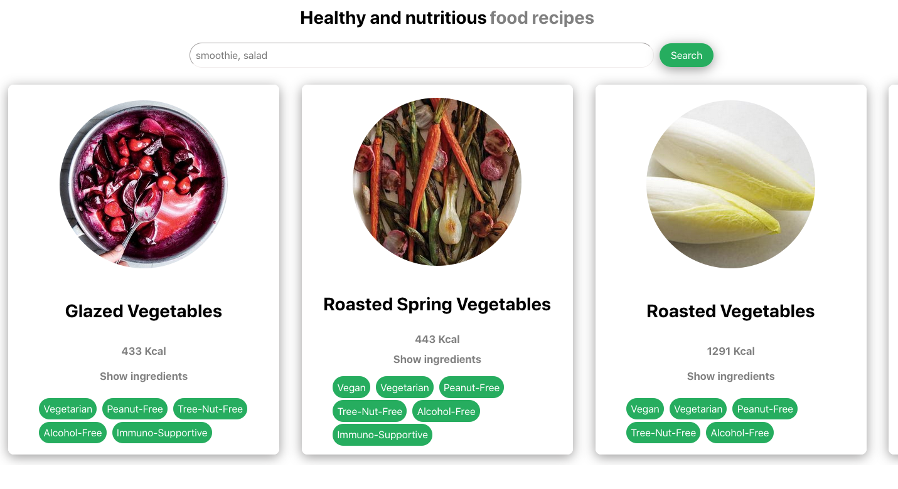

# Recipe Search

> Side project using a free API 

### An App For Healthy And Nutritious Food Recipes

What is the best recipe & nutrition? View the recipes from [edamam´s API](https://developer.edamam.com/) and search for the best food. 

### Design

## `Tech Stack`

- API
- React
- React Hooks
- CSS
- CSS module
- Git Workflow
- npm
- Vercel

## `Project setup`

1. Clone this repository.
2. Install all npm dependencies

   `npm install`

3. To run the app in development mode npm start, then open http://localhost:3000 to view it in the browser

